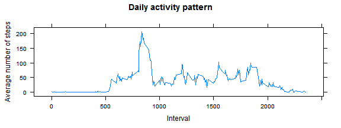

## Loading and preprocessing the data
Loading libraries

```r
options(digits=3, scipen=999)  
suppressMessages(require(dplyr));suppressMessages(require(lattice))
```

Loading data in working directory
Converse date variable to date format


```r
data      <- read.csv("activity.csv")
data$date <- as.Date(data$date)
```
## What is mean total number of steps taken per day?

```r
dat  <- data %>%
          group_by(date) %>%
          summarise(step_day = sum(steps, na.rm=TRUE))
range_step <- range(dat$step_day)
histogram(~ step_day, data=dat,
          type="density",
          main="Total number of steps a day",
          xlab="Steps per day",
          breaks=seq(from=range_step[1], to=range_step[2], length=12))
```

 


```r
mean_step   <- round(mean(dat$step_day), 2)
median_step <- median(dat$step_day)
```
The **mean** number of steps per day are **9354.23** (**median**: **10395**).

## What is the average daily activity pattern?

```r
dat <- data %>%
         group_by(interval) %>%
         summarise(step_interval = mean(steps, na.rm=TRUE))

xyplot(step_interval ~ interval, data=dat, type='l', 
       xlab="Interval", ylab="Average number of steps", 
       main="Daily activity pattern")
```

 


```r
max_interval <- dat[which.max(dat$step_interval), "interval"]
max_steps    <- round(dat[which.max(dat$step_interval), "step_interval"], 0)
```
The **maximum** number of steps is in the **interval 835** with an **average** of **206** steps.

## Imputing missing values

```r
number_missing <- sum(is.na(data$steps))
```
There are **2304 missing values** in the data set.
The **missing Values** are imputed by the **mean**.

```r
missing_dat <- data %>%
                 group_by(interval) %>%
                 summarise(steps_missing = mean(steps, na.rm=TRUE))

dat       <- merge(data, missing_dat, by="interval")
dat$steps <- ifelse(is.na(dat$steps), dat$steps_missing, dat$steps)

dat  <- dat %>%
          group_by(date) %>%
          summarise(step_day = sum(steps, na.rm=TRUE))
range_step   <- range(dat$step_day)
mean_step   <- round(mean(dat$step_day), 2)
median_step <- median(dat$step_day)
histogram(~ step_day, data=dat,
          type="density",
          main="Total number of steps a day",
          xlab="Steps per day",
          breaks=seq(from=range_step[1], to=range_step[2], length=12))
```

 

The **mean** number of steps per day are **10766.19** (**median**: **10766.189**).
The imputation does effect the average number. 

## Are there differences in activity patterns between weekdays and weekends?

```r
dat <- data %>%
         mutate(weekend = ifelse(weekdays(data$date) %in% c("Samstag", "Sonntag"),
                                 "weekend", "weekday"),
                weekend = as.factor(weekend)) %>%
         group_by(weekend, interval) %>%
         summarise(avg_steps = mean(steps, na.rm=TRUE))
  
xyplot(avg_steps ~ interval | weekend, data=dat, type='l', layout=c(1,2),
       xlab="Interval", ylab="Average number of steps", 
       main="Activity pattern weekdays vs. weekends")
```

 
